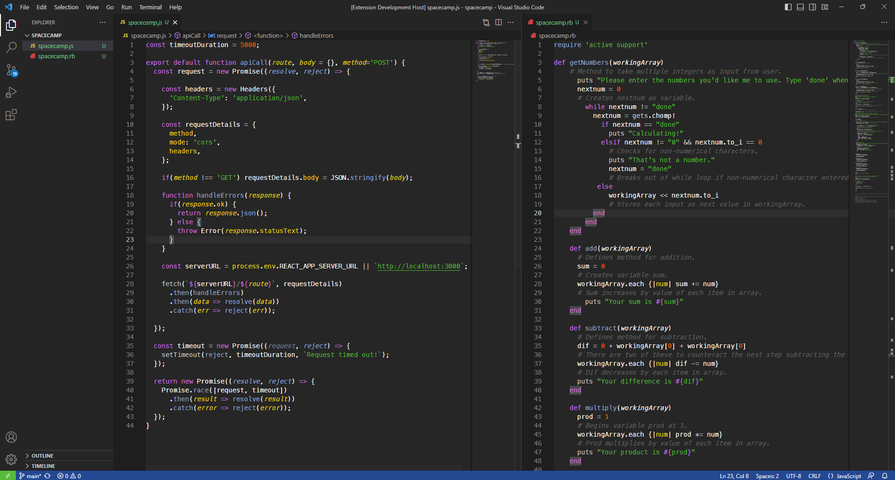

# SpaceCamp Theme [VSCODE]

> A dark theme for [Visual Studio Code](http://code.visualstudio.com).




## Installation

You can download the extension from the `Extensions(Ctrl+Shift+X)` tab in Visual Studio Code or directly from Visual Studio Marketplace, link attached below.

[Download SpaceCamp Extension](https://marketplace.visualstudio.com/items?itemName=PaulGomez.spacecamp)

## About
SpaceCamp is dark theme for VS Code, inspired and ported from the original [SpaceCamp](https://github.com/jaredgorski/SpaceCamp/tree/master
) for Vim by [Jared Gorski](https://github.com/jaredgorski)


## Extra
Adding this to your `settings.json` will disable bracket colorization to make the theme more appealing.
```json
{
    // Bracket-pair colorization
    "editor.bracketPairColorization.enabled": false, 

    // Bracket-pair guides
    "editor.guides.bracketPairsHorizontal": false,
    "editor.guides.highlightActiveBracketPair": false,

    // Indentation guides
    "editor.guides.indentation": false,
    "editor.guides.highlightActiveIndentation": false
}
```